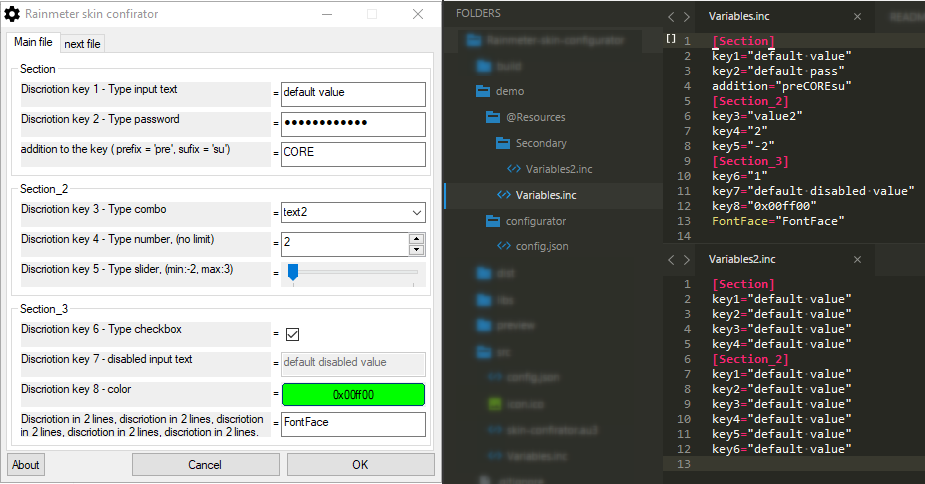

# Rainmeter skin configurator

## Preview


## Installing
* Download [last release](https://github.com/Findoss/Rainmeter-skin-configurator/releases)

## Using
Create file config.json ([demo](https://github.com/Findoss/Rainmeter-skin-configurator/blob/master/demo/configurator/config.json))

### INI file configurate
```
"pathConfigFile": String,  // path config file
"name": String,            // [optional] name config file
```

### Section
```
"sections": [           // sections
  {
    "name": String,     // name section
    "inputs": [Objects] // inputs
  }
]
```

### Inputs

#### Input text
```
  "type": "input", 
  "key": String,         // key
  "prefix": String,      // [optional] prefix
  "sufix": String,       // [optional] sufix
  "discriotion": String, // [optional] discriotion
  "default": String,     // [optional] default value
  "disabled": Boolean    // [optional] is disabled
```

#### Password
```
  "type": "password", 
  "key": String,         // key
  "prefix": String,      // [optional] prefix
  "sufix": String,       // [optional] sufix
  "discriotion": String, // [optional] discriotion
  "default": String,     // [optional] default value
  "disabled": Boolean    // [optional] is disabled
```

#### Combo box
```
  "type": "combo", 
  "key": String,         // key
  "options": [
    {
      "value": String,
      "text": String     // [optional] text option
    }
    ... (next options)
  ],
  "prefix": String,      // [optional] prefix
  "sufix": String,       // [optional] sufix
  "discriotion": String, // [optional] discriotion
  "default": String      // [optional] default value option
```

#### Number
```
  "type": "number", 
  "key": String,         // key
  "prefix": String,      // [optional] prefix
  "sufix": String,       // [optional] sufix
  "discriotion": String, // [optional] discriotion
  "default": Number,     // [optional] default value
  "disabled": Boolean,   // [optional] is disabled
  "limit": {             // [optional] limit
    "min": Number,       // min value
    "max": Number        // max value
  }
```

#### Color pikcer
```
  "type": "color", 
  "key": String,         // key
  "prefix": String,      // [optional] prefix
  "sufix": String,       // [optional] sufix
  "discriotion": String, // [optional] discriotion
  "default": String,     // [optional] default value (HEX format !)
  "disabled": Boolean    // [optional] is disabled
```

#### Slider
```
  "type": "slider", 
  "key": String,         // key
  "prefix": String,      // [optional] prefix
  "sufix": String,       // [optional] sufix
  "discriotion": String, // [optional] discriotion
  "default": Number,     // [optional] default value
  "disabled": Boolean,   // [optional] is disabled
  "limit": {             // [optional] limit
    "min": Number,       // min value
    "max": Number        // max value
  }
```

#### Checkbox
```
  "type": "checkbox", 
  "key": String,         // key
  "prefix": String,      // [optional] prefix
  "sufix": String,       // [optional] sufix
  "discriotion": String, // [optional] discriotion
  "default": Number,     // [optional] only 1 (TRUE) or 0 (FALSE)
  "disabled": Boolean    // [optional] is disabled
```

### ! Limits
Configuration files = no limits  
Sections = 15 in file  
Color Pickers = 40 in file  
Inputs = 25 in section  
Discriotion lines = 2

## Plans
More type input (edit, float)  
[Read more](https://github.com/Findoss/Rainmeter-skin-configurator/projects)

## License
[MIT](https://github.com/Findoss/Rainmeter-skin-configurator/blob/master/LICENSE.txt). Copyright (c) [Findoss](https://github.com/Findoss).