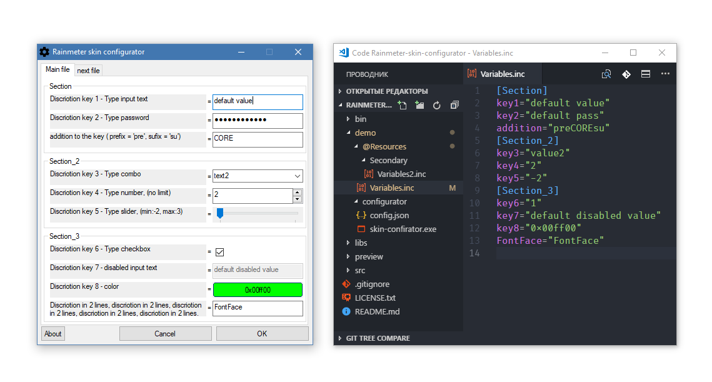

# Rainmeter skin configurator

## Preview


## Installing
* Download [last release](https://github.com/Findoss/Rainmeter-skin-configurator/releases)

## Using
Create file config.json

```
{
  "config": [
    {
      "pathConfigFile": "../@Resources/Variables.inc",               // path config file
      "section": [
        {
          "name": "Variables",                                       // name section
          "inputs": [                                                // inputs
            {
              "type": "input",                                       // type input
              "discriotion": "Enter the name of the topic you like", // discriotion key
              "key":"Theme"                                          // key
            },
            ... MORE INPUT
          ]
        },
        ... MORE SECTION
      ]
    },
    ... MORE CONFIG FILE
  ]
}

```
#### Exemple
[demo config.json](https://github.com/Findoss/Rainmeter-skin-configurator/blob/master/demo/configurator/config.json)

### Type inputs
* input

### Limits
Configuration files = no limits  
sections = 15 in file  
inputs = 25 in section


## Plans
* More type input
* Default value input  
[Read more](https://github.com/Findoss/Rainmeter-skin-configurator/projects)

## License
[MIT](https://github.com/Findoss/Rainmeter-Machu-Picchu/blob/master/LICENSE.txt). Copyright (c) [Findoss](https://github.com/Findoss).